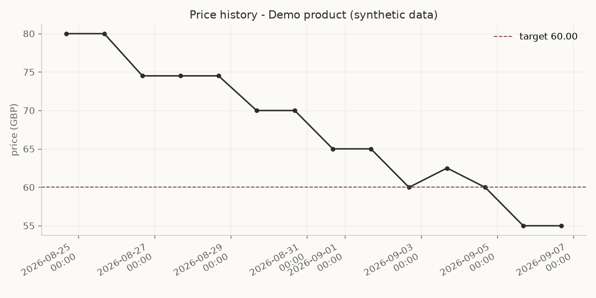
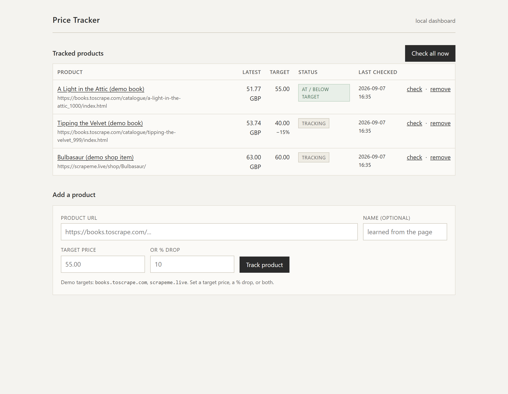
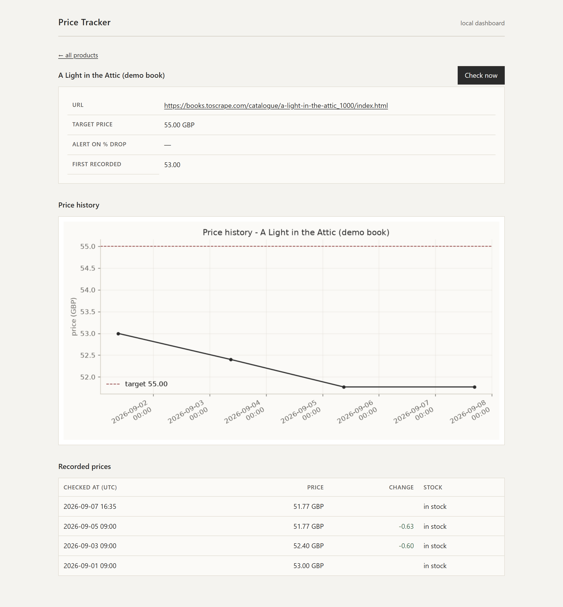

# Price Tracker with Alerts

[](https://github.com/NavenduChaturvedi/Price-tracker-scrapping-/actions/workflows/ci.yml)

[](LICENSE)

A small command-line tool that watches product prices on e-commerce pages,
keeps a full price history in a local SQLite database, and sends you an alert
(Telegram or email) when a price drops below a target or falls by a set
percentage.

It ships configured for two **scraping-friendly demo stores** so it runs
end-to-end the moment you clone it — no accounts, no API keys, no fighting
bot-detection. Adding a real store is one small parser function (see
[DECISIONS.md](DECISIONS.md)).

---

## Features

| # | Feature | Where |
|---|---------|-------|
| 1 | Add a product URL + target price to track | `tracker.py add` |
| 2 | Manual `check` run (cron / Task Scheduler is a documented next step) | `tracker.py check` |
| 3 | Full price history stored in SQLite | `price_tracker/db.py` |
| 4 | Alert when price ≤ target **or** drops ≥ N % from first seen | `price_tracker/core.py` |
| 5 | Telegram **or** SMTP email delivery, chosen automatically | `price_tracker/alerts.py` |
| 6 | `robots.txt` respected, polite delay + jitter, retry/back-off on 429/5xx | `price_tracker/scraper.py` |
| 7 | Optional matplotlib price-history chart (stretch goal) | `price_tracker/chart.py` |

Graceful by design: a bad URL, a site being down, a layout change, or a
`robots.txt` block fails **that one product** and the run continues.

---

## Setup

Requires Python 3.10+.

```bash
git clone https://github.com/NavenduChaturvedi/Price-tracker-scrapping-.git
cd Price-tracker-scrapping-

python -m venv .venv
# Windows:
.venv\Scripts\activate
# macOS / Linux:
source .venv/bin/activate

pip install -r requirements.txt
```

Alerts are optional. To enable them, copy the example config and fill in what
you need:

```bash
cp .env.example .env
```

Every setting has a default, so an empty `.env` (or no `.env` at all) is fine —
alerts then just print to the console.

---

## Usage

```bash
# Load the three sample products
python tracker.py import products.json

# Or add your own
python tracker.py add "https://books.toscrape.com/catalogue/a-light-in-the-attic_1000/index.html" 55.00
python tracker.py add "https://scrapeme.live/shop/Bulbasaur/" --pct-drop 10 --name "Bulbasaur"

# Scrape everything now, store prices, fire alerts
python tracker.py check

# Just one product
python tracker.py check --only 2

# Inspect
python tracker.py list
python tracker.py history 1
python tracker.py history 1 --limit 10

# Chart (stretch goal)
python tracker.py chart 1 --output charts/book.png

# Stop tracking
python tracker.py remove 3
```

### Scheduling (next step, not required)

Run `python tracker.py check` from cron or Windows Task Scheduler, e.g. every
6 hours:

```cron
0 */6 * * *  cd /path/to/repo && .venv/bin/python tracker.py check >> tracker.log 2>&1
```

---

## Sample output

```text
$ python tracker.py check
checking #1: A Light in the Attic (demo book)

[ALERT - no delivery method configured]
  Price drop: A Light in the Attic
  A Light in the Attic
  https://books.toscrape.com/catalogue/a-light-in-the-attic_1000/index.html

  Current price : 51.77 GBP
  Target price  : 55.00
  First seen at : 51.77
  Why           : at/below target 55.00
    price: 51.77 GBP (in stock)
checking #2: Tipping the Velvet (demo book)
    price: 53.74 GBP (in stock)
checking #3: Bulbasaur (demo shop item)
    price: 63.00 GBP (in stock)

done: 3 checked, 3 ok, 0 failed, 0 alert(s) sent
```

A URL that 404s (or a site that is down) does not crash the run:

```text
$ python tracker.py check --only 4
checking #4: https://books.toscrape.com/catalogue/nope_9999/index.html
    ! fetch failed: HTTP 404 for https://books.toscrape.com/catalogue/nope_9999/index.html

done: 1 checked, 0 ok, 1 failed, 0 alert(s) sent
```

Full transcript: [sample_output/sample_run.txt](sample_output/sample_run.txt).

### Price-history chart



> The demo sites have stable prices, so this chart is rendered from **synthetic
> data** by `scripts/generate_demo_chart.py` purely to show the feature. Real
> runs build the same chart from stored history.

---

## Web dashboard (optional)

A small local Flask dashboard over the same `price_tracker` package: list
tracked products, add one, run a check, and view a product's price history and
chart. It adds no logic of its own — every button calls the same functions the
CLI does.

```bash
pip install -r requirements-web.txt
python -m webapp          # http://127.0.0.1:5000
```




---

## Telegram alerts in 2 minutes

1. Message [@BotFather](https://t.me/BotFather) → `/newbot` → copy the token.
2. Send your new bot any message.
3. Open `https://api.telegram.org/bot<TOKEN>/getUpdates` and copy your numeric
   `chat.id`.
4. Put both in `.env`:

   ```env
   TELEGRAM_BOT_TOKEN=123456:ABC...
   TELEGRAM_CHAT_ID=987654321
   ```

`ALERT_METHOD=auto` (the default) then uses Telegram automatically.

---

## Project layout

```
tracker.py               CLI entry point (argument parsing + dispatch only)
price_tracker/
    config.py            settings from .env / env vars, with defaults
    db.py                SQLite persistence (products + price_history)
    scraper.py           HTTP fetch, robots.txt, retry/back-off
    parsers.py           HTML -> price, one function per site + generic fallback
    alerts.py            Telegram / email delivery (never raises)
    core.py              orchestration for each CLI command
    chart.py             optional matplotlib chart
webapp/                  optional Flask dashboard (see requirements-web.txt)
products.json            sample seed file
tests/                   offline parser tests (pytest)
scripts/                 dev helper: demo-chart generator
```

## Running the tests

```bash
pip install -r requirements-dev.txt
python -m pytest -q
```

## Scope / non-goals

See [DECISIONS.md](DECISIONS.md) for why each choice was made. In short: static
`requests` + `BeautifulSoup` only (no headless browser), SQLite (no server),
manual `check` (no built-in scheduler), and demo stores chosen so the portfolio
piece always runs.

## License

MIT — see [LICENSE](LICENSE).
